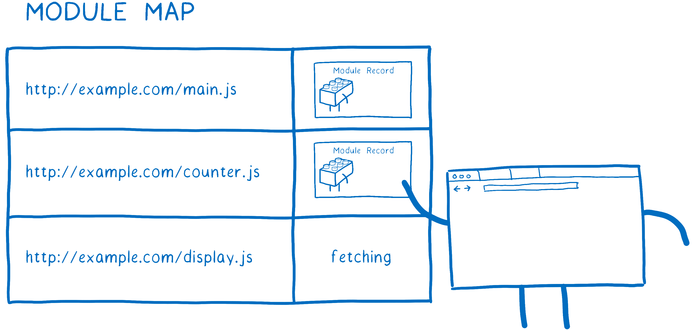

# ⬡ Loader339

𝗪𝗜𝗣：A prototype of a patching/instrumenting ES module loader.

| Node.js  |
| :------: |
| v13.7.0+ |

## Basic System Goals

_The goals below represent requirements voiced in issues about outstanding user
needs related to custom module loading. The custom module loader, which is
currently experimental, has been employed to solve for use cases that were
prohibitive to ES module adoption._

### Status per User Goal

○ patch a module w/o changing its URL in the [_module map_](#module-map)  
○ rewrite the URL of an import request before loader resolution  
○ more than one active [APM](#apm)/transformer within a single app  
△ safe hook application in an arbitrary sequence  
△ patch/wrap a module's exports  
├── ○ wrap `export default ...` w/ IIFE  
├── △ wrap APIs and don't patch away exports  
├── △ wrap all of a module's exported functions  
└── △ wrap only a few of a module's exported functions  
△ keep track of imported modules  
├── ○ format  
├── △ specifier  
└── ○ URL  
△ access a module's compiled source code  
├── △ user module code  
└── △ node builtin module code  
× insert Modules into a module's local ES module cache  
× insert Modules into the global ES module cache  
× rewrite a module's compiled source code  
├── × user module code  
└── × node builtin module code  
△ [_monkey patch_](#monkey-patch) a module at import time  
├── ○ user module code  
└── × node builtin module code

### Status per Platform Goal

△ `vm.Module` & ways to create custom ES module implementations such as those
seen in [jsdom](https://github.com/jsdom/jsdom)  
△ `vm.ReflectiveModule` as a means to declare a list of exports and expose a
reflection API to those exports  
△ provide an option to both `vm.Script` and `vm.Module` to intercept `import()`

---

<table>
<caption><small>Key</small></caption>
<tbody>
<tr><td>◎</td><td>supported/demonstrated w/ tests</td></tr>
<tr><td>○</td><td>supported/demonstrated</td></tr>
<tr><td>△</td><td>partially supported/demonstrated</td></tr>
<tr><td>×</td><td>unsupported/undemonstrated</td></tr>
<tbody>
</table>

## Key Terms

<dl>
<dt id="apm">application performance management (APM)</dt>
<dd>

the monitoring and management of performance and availability of software
applications — strives to detect and diagnose complex application performance
problems to maintain an expected level of service

</dd>
<dt id="module-map">

[module map](https://html.spec.whatwg.org/multipage/webappapis.html#module-map)

</dt>
<dd>

a map of URL records to values that are either a module script, null (used to
represent failed fetches), or a placeholder value `"fetching"` — used to ensure
that imported JavaScript modules are only fetched, parsed, and evaluated once
per Document or worker [1](#ref1)

 _A cartoon module map, by
[Lin Clark](https://twitter.com/linclark). [2](#ref2)_

</dd>

<dt id="monkey-patch">monkey patch</dt>
<dd>

a way for a program to extend or modify a module or class while the program is
running locally (affecting only the running instance of the program)

</dd>
</dl>

---

1
[Web application API](https://html.spec.whatwg.org/multipage/webappapis.html#module-map)

2
[ES modules: A cartoon deep-dive](https://hacks.mozilla.org/2018/03/es-modules-a-cartoon-deep-dive/)
